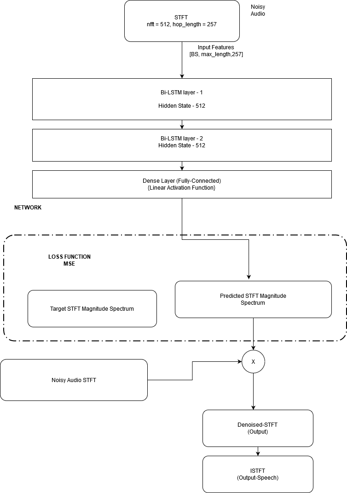
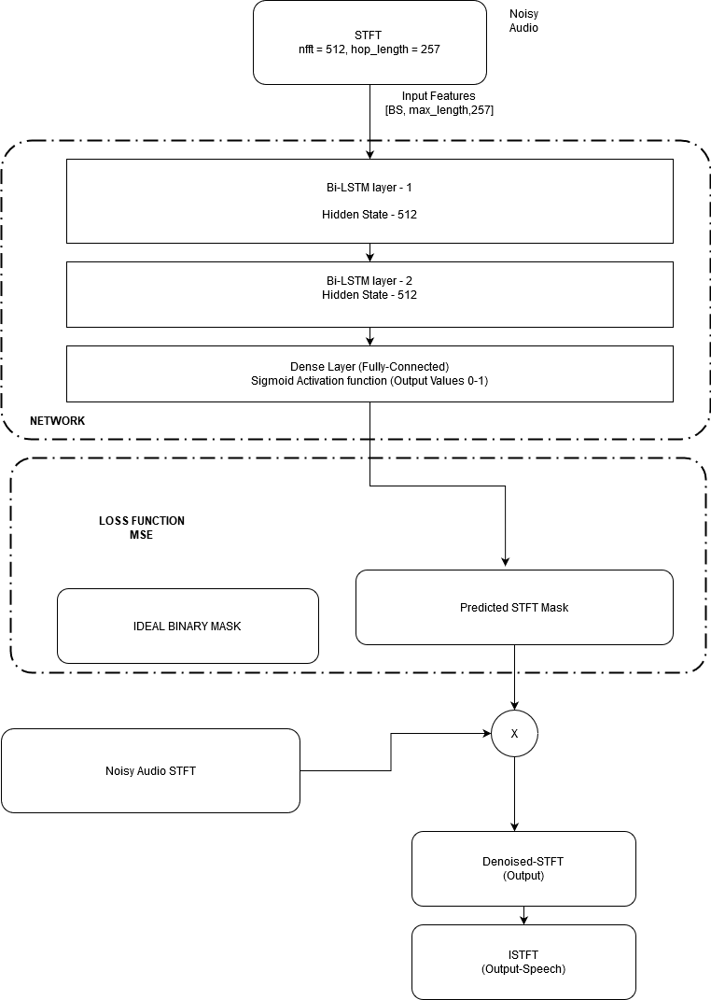

# speech-enhancement-IITGN

# PROJECT TITLE:
## Noise Reduction in speech using Recurrent Neural Networks 
### Noise Description 
For training dataset we have taken samples of pink noise and wind noise(recorded around 1 hour of data @ IIT-Gn Mechanical Lab), added random samples of wind noise, pink noise plus combination of pink and wind (all @ 0dB ).
10,000 clean speech samples are taken from Mozilla corpus for clean speech and added noise samples accordingly.

Testing set containts pink noise and noisy wind samples from IKS-Wind Dataset added to clean speech.

### Architecture with STFT based target 

### Architecture with Ideal Binary Mask as target

## Results
-- Inside results folder
